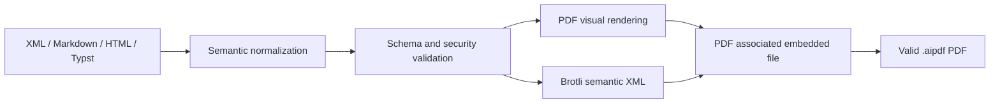
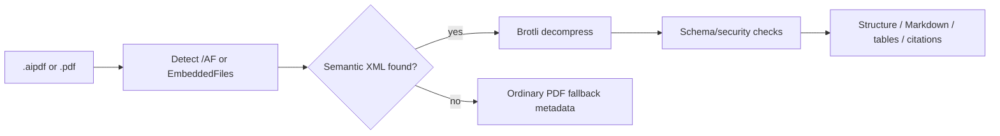

# Architecture Diagrams

## Build Pipeline

```mermaid
flowchart LR
  Source["XML / Markdown / HTML / Typst"] --> Normalize["Semantic normalization"]
  Normalize --> Validate["Schema and security validation"]
  Validate --> Render["PDF visual rendering"]
  Validate --> Compress["Brotli semantic XML"]
  Render --> Embed["PDF associated embedded file"]
  Compress --> Embed
  Embed --> AIPDF["Valid .aipdf PDF"]
```

## Parse Pipeline

```mermaid
flowchart LR
  File[".aipdf or .pdf"] --> Detect["Detect /AF or EmbeddedFiles"]
  Detect --> HasSemantic{"Semantic XML found?"}
  HasSemantic -->|yes| Decompress["Brotli decompress"]
  Decompress --> Validate["Schema/security checks"]
  Validate --> API["Structure / Markdown / tables / citations"]
  HasSemantic -->|no| Fallback["Ordinary PDF fallback metadata"]
```

